# 🛡️ Home SOC Lab

### Hands-On Security Operations Center Laboratory

<p align="center">
  
  
  
  
  
</p>

<p align="center">
  <strong>A practical SOC environment for endpoint monitoring, SIEM analysis, detection engineering, investigation, and security operations.</strong>
</p>

---

# 📌 Project Overview

This project is a **hands-on Home Security Operations Center (SOC)** built to simulate a real-world security monitoring environment.

The laboratory combines:

- ☁️ AWS cloud infrastructure
- 🛡️ Wazuh SIEM
- 🪟 Windows 10 endpoint
- 🔎 Microsoft Sysmon
- ⚡ PowerShell Script Block Logging
- 🔐 Windows Security Events
- 🛡️ Microsoft Defender
- 📁 File Integrity Monitoring
- 📊 Security event investigation
- 📝 SOC documentation

The goal is not simply to install a SIEM, but to understand the complete security monitoring workflow:

```text
Generate Activity
       ↓
Collect Telemetry
       ↓
Forward Events
       ↓
Analyze Events
       ↓
Investigate
       ↓
Document
       ↓
Improve Detection
```

---

# 🏗️ SOC Architecture


---

# 🔄 Security Monitoring Pipeline

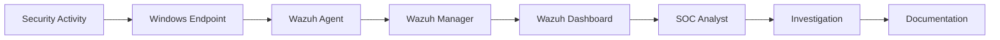

---

# 🧰 Technology Stack

| Category | Technology |
|---|---|
| SIEM | Wazuh |
| Cloud | AWS EC2 |
| Endpoint | Windows 10 |
| Endpoint Telemetry | Microsoft Sysmon |
| Log Collection | Wazuh Agent |
| Authentication Monitoring | Windows Security Logs |
| PowerShell Monitoring | PowerShell Script Block Logging |
| Malware Telemetry | Microsoft Defender |
| File Monitoring | Wazuh FIM / Syscheck |
| Virtualization | Oracle VirtualBox |
| Security OS | Kali Linux |
| Documentation | GitHub |

---

# 🎯 Objectives

The laboratory was designed around practical SOC Analyst capabilities.

### Core Objectives

- Build a functional SIEM environment
- Deploy and manage a Windows endpoint
- Configure Wazuh Agent communication
- Collect Windows security telemetry
- Monitor failed authentication
- Monitor PowerShell activity
- Monitor process creation
- Monitor file integrity
- Collect Microsoft Defender telemetry
- Generate controlled security events
- Investigate security events
- Document investigation findings
- Understand the SOC detection lifecycle

---

# 🔎 Detection Coverage

| ID | Detection | Source | Event | Status |
|---|---|---|---|---|
| DET-01 | Failed Login | Windows Security | `4625` | ✅ Tested |
| DET-02 | PowerShell Activity | PowerShell | `4104` | ✅ Tested |
| DET-03 | Process Creation | Sysmon | `1` | ✅ Tested |
| DET-04 | File Modification | Wazuh FIM | Syscheck | ✅ Tested |
| DET-05 | Malware Detection | Microsoft Defender | `1116` | ✅ Tested |

---

# 🚨 DET-01 — Failed Windows Login

## Objective

Detect unsuccessful authentication attempts through Windows Security Event Logs.

### Event ID

```text
4625
```

### Test Scenario

A controlled failed authentication attempt was generated on the Windows endpoint.

### Detection Flow

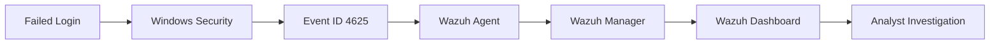

### Investigation Data

The event can provide information including:

- Username
- Computer name
- Logon type
- Failure reason
- Timestamp
- Authentication information

### SOC Relevance

Failed authentication telemetry can be useful for investigating:

- Repeated authentication failures
- Incorrect credentials
- Account targeting
- Suspicious login activity
- Potential brute-force patterns

---

# ⚡ DET-02 — PowerShell Script Block Logging

## Objective

Monitor PowerShell activity using Windows Script Block Logging.

### Event ID

```text
4104
```

### Detection Flow

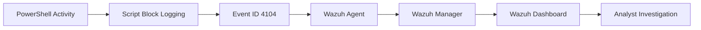

### Telemetry

PowerShell Script Block Logging can provide visibility into:

- Script content
- PowerShell activity
- User context
- Execution timestamps
- Administrative commands

### SOC Relevance

PowerShell telemetry can support investigations involving:

- Suspicious scripting
- Administrative activity
- Post-exploitation behavior
- Command execution
- Living-off-the-land techniques

---

# 🖥️ DET-03 — Sysmon Process Creation

## Objective

Use Microsoft Sysmon to obtain detailed endpoint process telemetry.

### Event ID

```text
Sysmon Event ID 1
```

### Detection Flow

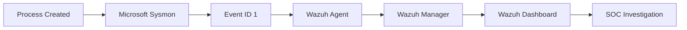

### Available Telemetry

Process creation events can provide information such as:

- Process name
- Process path
- Parent process
- Command line
- User
- Process GUID
- Hash information
- Timestamp

### SOC Relevance

Process telemetry is valuable for:

- Endpoint investigation
- Parent-child process analysis
- Suspicious execution analysis
- Command-line investigation
- Malware investigation

---

# 📁 DET-04 — File Integrity Monitoring

## Objective

Monitor changes to files within a controlled SOC test directory.

### Test Directory

```text
C:\SOC-Test
```

### Detection Flow

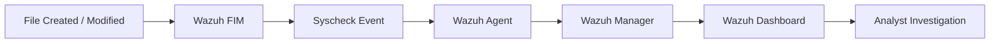

### Monitored Attributes

Wazuh FIM can provide information such as:

- File path
- File size
- Modification time
- MD5
- SHA hashes
- Windows permissions

### SOC Relevance

File integrity monitoring can support investigation of:

- Unauthorized modifications
- Configuration changes
- Suspicious files
- Persistence mechanisms
- Potential web shells
- Malware-related file changes

---

# 🛡️ DET-05 — Microsoft Defender Detection

## Objective

Collect Microsoft Defender operational telemetry through Wazuh.

### Event ID

```text
1116
```

### Controlled Validation

The **EICAR antivirus test file** was used to validate the Defender-to-Wazuh monitoring pipeline.

> No real malware was used.

### Observed Detection

```text
Virus:DOS/EICAR_Test_File
```

### Detection Flow

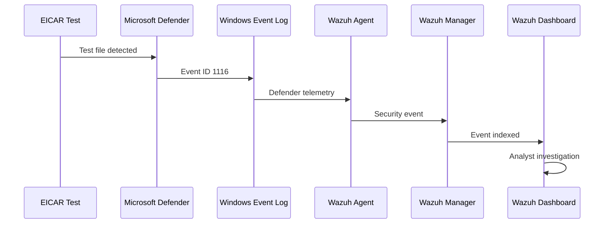

### SOC Relevance

Defender telemetry provides visibility into:

- Antivirus detections
- Threat names
- Detection severity
- Security events
- Endpoint protection activity

---

# 📊 Detection Matrix

| Detection | Data Source | Event ID | Investigation Focus |
|---|---|---:|---|
| Failed Login | Windows Security | `4625` | Authentication |
| PowerShell | PowerShell Logging | `4104` | Script Activity |
| Process Creation | Sysmon | `1` | Endpoint Execution |
| File Integrity | Wazuh FIM | Syscheck | File Changes |
| Defender Detection | Microsoft Defender | `1116` | Malware Telemetry |

---

# 📸 Evidence Gallery

Actual evidence collected from the laboratory environment is stored in the `screenshots/` directory.

---

## 🔐 01 — Failed Login Detection

**Windows Security Event ID: `4625`**

<p align="center">
  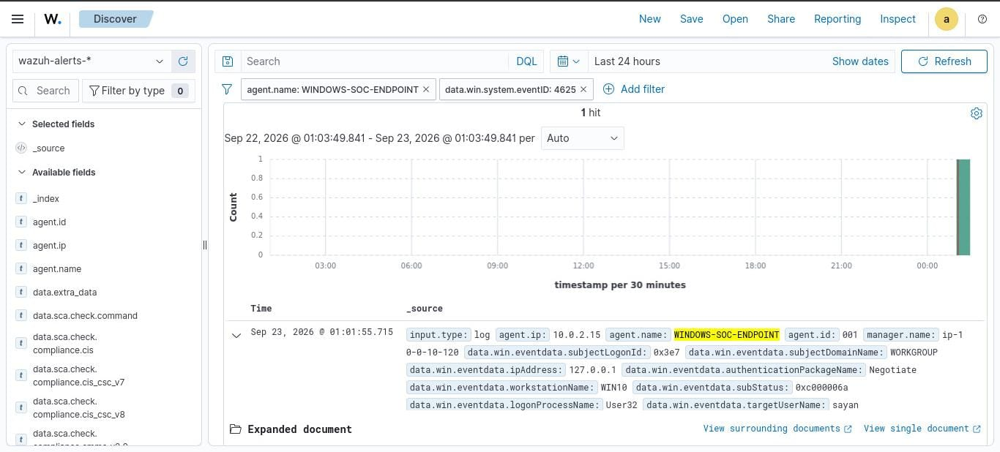
</p>

<p align="center">
  <strong>Figure 1 — Windows Failed Authentication Event</strong>
</p>

---

## ⚡ 02 — PowerShell Script Block Logging

**Windows PowerShell Event ID: `4104`**

<p align="center">
  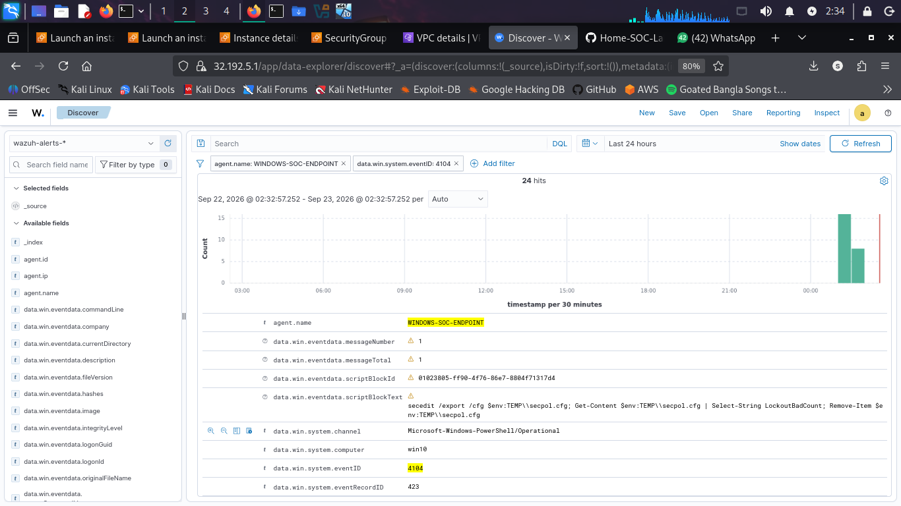
</p>

<p align="center">
  <strong>Figure 2 — PowerShell Script Block Telemetry</strong>
</p>

---

## 🖥️ 03 — Sysmon Process Creation

**Sysmon Event ID: `1`**

<p align="center">
  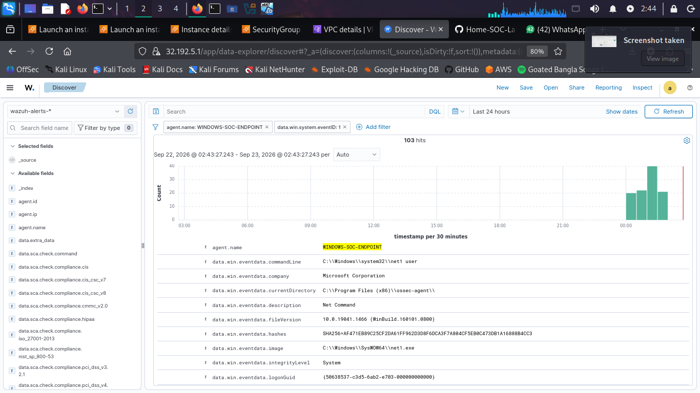
</p>

<p align="center">
  <strong>Figure 3 — Sysmon Process Creation Telemetry</strong>
</p>

<p align="center">
  
</p>

<p align="center">
  <strong>Figure 4 — Process Event Details in Wazuh</strong>
</p>

---

## 🛡️ 04 — Microsoft Defender Detection

**Windows Defender Event ID: `1116`**

<p align="center">
  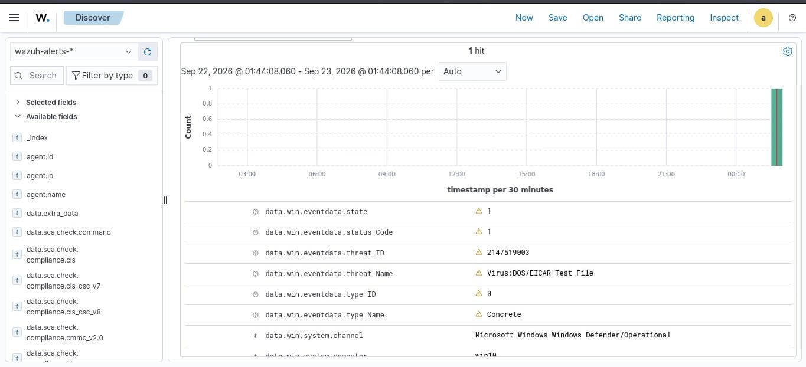
</p>

<p align="center">
  <strong>Figure 5 — Microsoft Defender EICAR Detection</strong>
</p>

---

# 🧪 Security Testing

All detection scenarios were performed in a controlled laboratory environment.

| Test | Method | Result |
|---|---|---|
| Failed Authentication | Controlled invalid login | ✅ Event received |
| PowerShell Logging | Controlled PowerShell activity | ✅ Event received |
| Process Monitoring | Normal Windows process execution | ✅ Event received |
| FIM | Controlled file modification | ✅ Event received |
| Defender | EICAR test file | ✅ Event received |

### Safety Principles

- No real malware was used.
- EICAR was used for antivirus validation.
- Testing was performed on the isolated laboratory endpoint.
- No unauthorized systems were targeted.
- Security credentials were not included in the repository.

---

# 🔬 SOC Investigation Methodology

The laboratory follows a simplified SOC workflow.

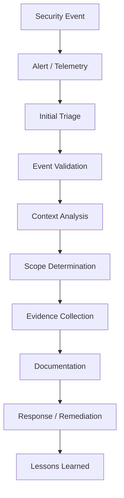

## 1. Alert Identification

Identify the security event and determine which endpoint generated the telemetry.

## 2. Initial Triage

Determine:

- What happened?
- When did it happen?
- Which host generated the event?
- Which user was involved?
- What process or activity was involved?

## 3. Event Validation

Determine whether the activity is:

- Expected
- Benign
- Suspicious
- Security-relevant

## 4. Context Analysis

Review available context such as:

- Username
- Hostname
- Process
- Parent process
- Command line
- Timestamp
- File path
- Hash
- Event ID

## 5. Scope Determination

Determine whether the event is isolated or potentially related to other activity.

## 6. Documentation

Record:

- Detection
- Evidence
- Timeline
- Investigation
- Actions
- Final disposition

---

# ☁️ AWS Infrastructure

The Wazuh Manager and Dashboard are hosted on an AWS EC2 instance.

```text
AWS Cloud
│
└── EC2 Instance
    │
    ├── Wazuh Manager
    │
    └── Wazuh Dashboard
```

### Security Configuration

Required Wazuh communication services include:

```text
1514/TCP  → Wazuh agent communication
1515/TCP  → Agent enrollment
443/TCP   → Wazuh Dashboard
22/TCP    → SSH administration
```

Network access is controlled through AWS security-group rules.

---

# 🪟 Windows Endpoint

The monitored endpoint is a Windows 10 virtual machine running inside Oracle VirtualBox.

```text
Windows 10 Endpoint
│
├── Wazuh Agent
│
├── Microsoft Sysmon
│
├── Windows Security Logs
│
├── PowerShell Script Block Logging
│
├── Microsoft Defender
│
└── Wazuh File Integrity Monitoring
```

### Wazuh Agent

```text
Agent Name:
WINDOWS-SOC-ENDPOINT
```

The endpoint successfully communicates with the Wazuh Manager and forwards security telemetry.

---

# 🧠 SOC Skills Demonstrated

## SIEM

- Wazuh
- Event analysis
- Alert investigation
- Log analysis
- Security monitoring

## Windows Security

- Windows Event Logs
- Authentication monitoring
- Event ID `4625`
- Event ID `4104`
- Event ID `1116`
- Microsoft Defender

## Endpoint Detection

- Microsoft Sysmon
- Process monitoring
- Command-line telemetry
- File Integrity Monitoring
- Endpoint investigation

## SOC Operations

- Alert triage
- Investigation
- Evidence collection
- Event correlation
- Documentation
- Controlled security testing

## Cloud Security

- AWS EC2
- Security Groups
- Cloud-hosted SIEM
- Network access control

---

# 🧩 MITRE ATT&CK Alignment

The project provides telemetry relevant to several MITRE ATT&CK techniques.

| Technique | ID | Laboratory Coverage |
|---|---|---|
| PowerShell | `T1059.001` | PowerShell Script Block Logging |
| Command & Scripting Interpreter | `T1059` | PowerShell monitoring |
| Process Discovery / Execution Analysis | Context dependent | Sysmon process telemetry |
| Valid Accounts / Authentication Activity | Context dependent | Windows authentication monitoring |
| File and Directory Modification | Context dependent | Wazuh FIM |

> MITRE mappings should be refined further when specific attack simulations and custom detection rules are added.

---

# 📂 Repository Structure

```text
Home-SOC-Lab/
│
├── README.md
│
└── screenshots/
    │
    ├── README.md
    ├── defender-eicar.jpeg
    ├── failed-login-4625.jpeg
    ├── powershell-scriptblock.png
    ├── sysmon-process-creation1.png
    └── sysmon-process-creation2.png
```

---

# 📈 Project Status

| Component | Status |
|---|---|
| AWS EC2 Infrastructure | ✅ Completed |
| Wazuh Manager | ✅ Completed |
| Wazuh Dashboard | ✅ Completed |
| Windows 10 Endpoint | ✅ Completed |
| Wazuh Agent | ✅ Completed |
| Sysmon Integration | ✅ Completed |
| Windows Security Monitoring | ✅ Completed |
| PowerShell Logging | ✅ Completed |
| File Integrity Monitoring | ✅ Completed |
| Microsoft Defender Integration | ✅ Completed |
| EICAR Validation | ✅ Completed |
| Detection Evidence | ✅ Documented |
| GitHub Documentation | ✅ Completed |

---

# 🚀 Future Improvements

The laboratory can be extended with additional SOC capabilities.

### Detection Engineering

- Custom Wazuh rules
- Custom decoders
- Brute-force detection
- Suspicious PowerShell detection
- Persistence detection
- Privilege escalation detection
- LOLBin detection

### Network Security

- Zeek
- Suricata
- Network traffic analysis
- DNS monitoring
- HTTP/HTTPS telemetry

### Threat Intelligence

- IOC enrichment
- IP reputation
- Hash reputation
- Threat intelligence feeds

### Infrastructure

- Additional Windows endpoints
- Linux endpoint monitoring
- Active Directory
- Centralized authentication monitoring

### Automation

- Automated alert enrichment
- Automated response
- Incident ticket generation
- SOC dashboards

---

# 📚 Learning Outcomes

This project provided practical experience with:

- SIEM architecture
- Endpoint telemetry
- Wazuh Agent communication
- Windows security events
- Sysmon
- PowerShell logging
- Microsoft Defender telemetry
- File Integrity Monitoring
- Alert investigation
- Security event correlation
- Evidence collection
- Incident documentation
- AWS cloud infrastructure

---

# 🔐 Security Considerations

The public repository must never contain:

```text
AWS Access Keys
AWS Secret Keys
Passwords
Wazuh Authentication Keys
API Tokens
Private Keys
SSH Keys
Session Tokens
```

Only sanitized screenshots and documentation should be committed.

---

# ⚠️ Disclaimer

This project was created for:

- Educational purposes
- Defensive cybersecurity training
- SOC Analyst practice
- Security monitoring
- Detection engineering

All testing was performed within a controlled laboratory environment.

No unauthorized systems were targeted.

The EICAR test file was used instead of real malware for antivirus validation.

---

# 👨‍💻 Author

## Sayan Ghosh

**Cybersecurity Student**

Advanced Networking & Cyber Security

### Areas of Interest

- 🛡️ Security Operations Center
- 🔎 SOC Analysis
- 📊 SIEM
- ⚡ Detection Engineering
- ☁️ Cloud Security
- 🌐 Network Security
- 🔬 Digital Forensics
- 🧪 Vulnerability Assessment & Penetration Testing

---

# ⭐ Project Summary

The **Home SOC Lab** demonstrates the construction of a practical security monitoring environment using:

```text
AWS
  +
Wazuh
  +
Windows 10
  +
Sysmon
  +
PowerShell Logging
  +
Microsoft Defender
  +
File Integrity Monitoring
```

The project demonstrates the complete security monitoring lifecycle:

```text
┌──────────────────────────┐
│   Security Activity      │
└────────────┬─────────────┘
             ↓
┌──────────────────────────┐
│   Endpoint Telemetry     │
└────────────┬─────────────┘
             ↓
┌──────────────────────────┐
│      Wazuh Agent         │
└────────────┬─────────────┘
             ↓
┌──────────────────────────┐
│     Wazuh Manager        │
└────────────┬─────────────┘
             ↓
┌──────────────────────────┐
│    Wazuh Dashboard       │
└────────────┬─────────────┘
             ↓
┌──────────────────────────┐
│     SOC Investigation    │
└────────────┬─────────────┘
             ↓
┌──────────────────────────┐
│     Documentation        │
└──────────────────────────┘
```

---

# 🏆 Project Highlights

| Area | Implementation |
|---|---|
| 🛡️ SIEM | Wazuh |
| ☁️ Cloud | AWS EC2 |
| 🪟 Endpoint | Windows 10 |
| 🔎 Telemetry | Microsoft Sysmon |
| 🔐 Authentication | Windows Event ID `4625` |
| ⚡ PowerShell | Event ID `4104` |
| 🖥️ Process Monitoring | Sysmon Event ID `1` |
| 📁 FIM | Wazuh Syscheck |
| 🛡️ Antivirus | Microsoft Defender |
| 🧪 Validation | EICAR |
| 📊 Investigation | Wazuh Dashboard |
| 📚 Documentation | GitHub |

---

<p align="center">
  <strong>🛡️ Built as a practical Home SOC laboratory for hands-on cybersecurity learning and portfolio development.</strong>
</p>

<p align="center">
  <sub>Home SOC Lab • Wazuh • AWS • Windows Security • Endpoint Monitoring</sub>
</p>
