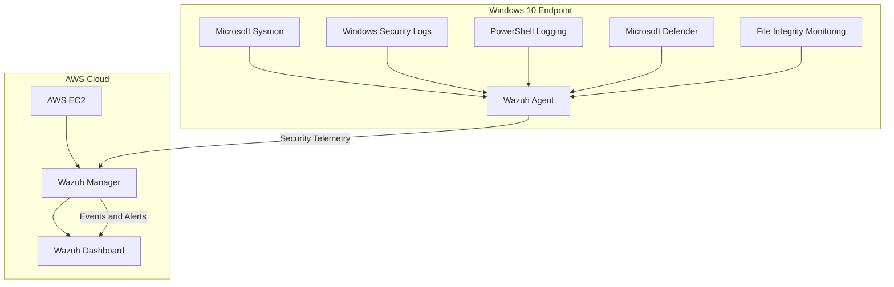
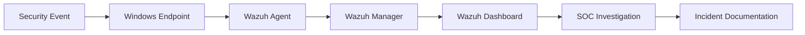
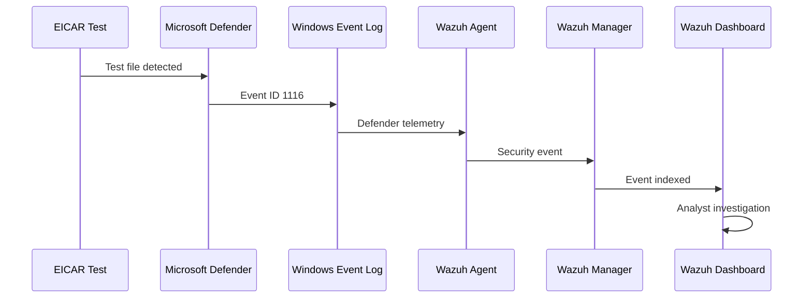
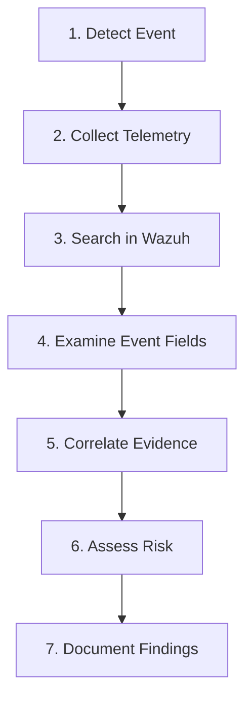

# 🛡️ Home SOC Lab

### Hands-on Security Operations Center Laboratory

A practical Home SOC environment built to develop real-world skills in **SIEM monitoring, Windows security monitoring, endpoint telemetry, detection, investigation, and incident documentation**.

---

## 🎯 Project Overview

This project simulates a small Security Operations Center using a Windows endpoint and a cloud-hosted Wazuh SIEM.

Security telemetry generated on the Windows endpoint is collected by the Wazuh Agent and forwarded to the Wazuh Manager hosted on AWS EC2. Events are then investigated through the Wazuh Dashboard.

The laboratory was built to practice the workflow of a junior SOC analyst:

**Detect → Collect → Investigate → Analyze → Document**

---

## 🏗️ Architecture



---

## 🔄 Security Monitoring Pipeline



---

## 🧰 Technologies

| Technology | Purpose |
|---|---|
| Wazuh | SIEM and endpoint monitoring |
| AWS EC2 | Cloud infrastructure for Wazuh Manager |
| Windows 10 | Monitored endpoint |
| Wazuh Agent | Endpoint telemetry collection |
| Microsoft Sysmon | Detailed endpoint telemetry |
| Microsoft Defender | Malware detection |
| Windows Event Logs | Security event collection |
| PowerShell | Endpoint administration and security testing |
| Wazuh FIM | File integrity monitoring |

---

# 🎯 Project Objectives

The main objectives of this laboratory were:

- Deploy a Wazuh SIEM environment
- Host the Wazuh Manager on AWS EC2
- Configure a Windows endpoint
- Install and register the Wazuh Agent
- Configure Sysmon telemetry
- Collect Windows Security events
- Monitor PowerShell activity
- Configure File Integrity Monitoring
- Collect Microsoft Defender events
- Generate controlled security events
- Investigate events through Wazuh Discover
- Document security investigations

---

# 🔍 Detection Coverage

| # | Detection | Source | Event / Mechanism | Status |
|---|---|---|---|---|
| 01 | Failed Windows Login | Windows Security | Event ID 4625 | ✅ Tested |
| 02 | PowerShell Activity | PowerShell | Script Block Logging | ✅ Tested |
| 03 | Process Activity | Sysmon | Process Telemetry | ✅ Tested |
| 04 | File Changes | Wazuh FIM | Syscheck | ✅ Tested |
| 05 | Malware Detection | Microsoft Defender | Event ID 1116 | ✅ Tested |

---

# 🚨 Detection 01 — Failed Windows Login

## Scenario

A failed Windows authentication attempt was generated on the monitored endpoint.

## Detection

**Event ID:** `4625`

Windows Security Event ID 4625 represents a failed logon attempt.

## Investigation

The event was investigated through Wazuh Discover.

Relevant information included:

- Username
- Computer name
- Logon type
- Failure reason
- Timestamp
- Authentication information

## SOC Analysis

A single failed authentication attempt does not automatically indicate malicious activity.

An analyst should correlate:

- Number of failed attempts
- Target username
- Source address
- Logon type
- Time pattern
- Subsequent successful authentication
- Other endpoint activity

---

# ⚡ Detection 02 — PowerShell Activity

## Scenario

PowerShell Script Block Logging was used to provide visibility into PowerShell activity.

## Investigation

The PowerShell telemetry was collected by the Wazuh Agent and investigated through Wazuh.

The investigation considered:

- Script content
- Execution time
- Endpoint
- User context
- Commands executed
- Related security events

## SOC Analysis

PowerShell is a legitimate Windows administration tool, so PowerShell activity alone is not evidence of malicious behavior.

The command or script content and surrounding telemetry must be examined.

---

# 🖥️ Detection 03 — Sysmon Process Activity

## Scenario

Microsoft Sysmon was deployed to provide enhanced endpoint telemetry.

Sysmon can provide useful information about process and system activity.

## Investigation

The investigation focused on information such as:

- Process name
- Process path
- Command line
- Parent process
- Timestamp
- User context
- Hash information when available

## SOC Questions

An analyst can ask:

```text
What process executed?
When did it execute?
Which user executed it?
Where was the executable located?
What process launched it?
Was the command line expected?
```

---

# 📁 Detection 04 — File Integrity Monitoring

## Scenario

Wazuh File Integrity Monitoring was configured and tested using a dedicated test directory.

Example:

`C:\SOC-Test`

## Detection

Wazuh generated `syscheck` events when monitored files changed.

Relevant information included:

- File path
- File size
- Modification time
- MD5 information
- Previous state
- Current state
- Windows permissions

## SOC Relevance

File Integrity Monitoring can assist investigations involving:

- Unexpected file changes
- Configuration modification
- Suspicious file creation
- Unauthorized modification
- Potential persistence activity

---

# 🛡️ Detection 05 — Microsoft Defender / EICAR

## Scenario

The standard **EICAR antivirus test file** was used to validate the Defender-to-Wazuh detection pipeline.

> No real malware was used.

## Detection

Microsoft Defender generated:

**Event ID:** `1116`

The event was collected from:

`Microsoft-Windows-Windows Defender/Operational`

## Confirmed Wazuh Detection

The event was successfully received and parsed by Wazuh.

The investigated event contained:

`Virus:DOS/EICAR_Test_File`

## Detection Pipeline



---

# 🔬 SOC Investigation Methodology

The lab follows a simplified SOC investigation process.



### 1. Detect

Identify the security event and determine what occurred.

### 2. Collect

Review telemetry from:

- Windows Security
- Sysmon
- PowerShell
- Microsoft Defender
- Wazuh FIM

### 3. Investigate

Examine:

- Timestamp
- Event ID
- Username
- Process
- Command line
- File path
- Hashes
- Severity
- Related events

### 4. Correlate

Look for related activity before and after the event.

### 5. Assess

Determine whether the event appears:

- Expected
- Suspicious
- Potentially malicious
- In need of additional investigation

### 6. Document

Record the evidence, investigation steps, findings, and recommended next actions.

---

# 📊 Detection Matrix

| Detection | Data Source | Event | Investigation Focus |
|---|---|---|---|
| Failed Login | Windows Security | 4625 | Authentication |
| PowerShell | PowerShell Logging | Script Block | Command activity |
| Process Activity | Sysmon | Process telemetry | Process execution |
| File Modification | Wazuh FIM | Syscheck | File changes |
| Malware Detection | Defender | 1116 | Threat detection |

---

# 📸 Evidence

Evidence screenshots will be stored in the repository.

Recommended evidence:

- Wazuh Dashboard
- Active Windows Agent
- Sysmon telemetry
- Failed Login Event 4625
- PowerShell Script Block event
- Wazuh FIM event
- Microsoft Defender Event 1116
- Wazuh EICAR detection

---

# 📂 Repository Structure

```text
home-soc-lab/
│
├── README.md
│
├── architecture/
│   └── architecture.png
│
├── setup/
│   ├── wazuh-manager.md
│   ├── windows-agent.md
│   └── sysmon.md
│
├── detections/
│   ├── failed-login.md
│   ├── powershell.md
│   ├── sysmon-process.md
│   ├── file-integrity.md
│   └── defender-eicar.md
│
├── incidents/
│   ├── 001-failed-login/
│   ├── 002-powershell/
│   ├── 003-file-integrity/
│   ├── 004-sysmon-process/
│   └── 005-defender-eicar/
│
└── screenshots/
    ├── wazuh-dashboard.png
    ├── active-agent.png
    ├── sysmon-process.png
    ├── failed-login-4625.png
    ├── powershell-scriptblock.png
    ├── fim.png
    └── defender-eicar.png
```

---

# 🧠 Skills Demonstrated

## SIEM

- Wazuh
- Event collection
- Log analysis
- Event filtering
- Security monitoring
- Alert investigation

## Windows Security

- Windows Event Logs
- Authentication monitoring
- Event ID 4625
- PowerShell logging
- Microsoft Defender
- Event ID 1116

## Endpoint Security

- Sysmon
- Process monitoring
- File Integrity Monitoring
- Malware detection

## Investigation

- Security event analysis
- Event correlation
- Timeline analysis
- Alert triage
- Evidence documentation

## Cloud

- AWS EC2
- Security Groups
- Cloud-hosted security infrastructure

---

# 🏆 Project Status

| Area | Status |
|---|---|
| Wazuh Manager | ✅ Complete |
| Wazuh Dashboard | ✅ Complete |
| AWS Infrastructure | ✅ Complete |
| Windows Endpoint | ✅ Complete |
| Wazuh Agent | ✅ Complete |
| Sysmon | ✅ Complete |
| Windows Security Monitoring | ✅ Complete |
| PowerShell Monitoring | ✅ Complete |
| File Integrity Monitoring | ✅ Complete |
| Defender Monitoring | ✅ Complete |
| Detection Testing | ✅ Complete |
| Event Investigation | ✅ Complete |
| Evidence Collection | ✅ Complete |
| Project Documentation | 🔄 Being organized |

---

# 🚀 Future Improvements

Planned future enhancements include:

- [ ] Ubuntu endpoint monitoring
- [ ] MITRE ATT&CK mapping
- [ ] Custom Wazuh detection rules
- [ ] Threat hunting
- [ ] Network traffic monitoring
- [ ] Vulnerability detection
- [ ] Automated response
- [ ] Brute-force detection
- [ ] Suspicious PowerShell detection
- [ ] Additional Windows attack simulations
- [ ] Advanced incident response exercises

---

# 📚 Learning Outcomes

This project provided hands-on practice with:

- SIEM deployment
- Endpoint monitoring
- Windows security telemetry
- Security event analysis
- Authentication monitoring
- PowerShell monitoring
- Sysmon telemetry
- File Integrity Monitoring
- Microsoft Defender integration
- Event investigation
- Basic SOC alert triage
- Incident documentation

---

# ⚠️ Disclaimer

This project was created for educational and defensive cybersecurity purposes in an isolated home laboratory environment.

Only controlled security testing was performed. No real malware was intentionally deployed.

---

# 👤 Author

## Sayan Ghosh

**Cybersecurity Student | Aspiring SOC Analyst**

### Areas of Interest

- Security Operations
- SIEM
- Blue Team
- Threat Detection
- Incident Response
- Endpoint Security
- Cloud Security

---

⭐ This project demonstrates a practical approach to building and investigating a small SOC environment using open-source and Windows security technologies.
